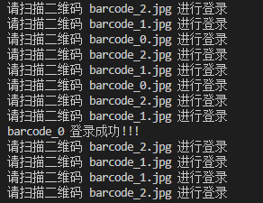
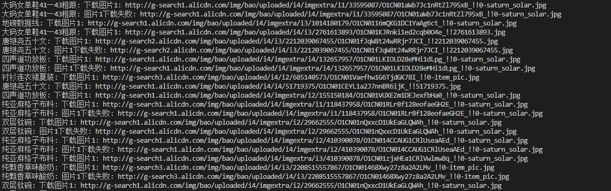
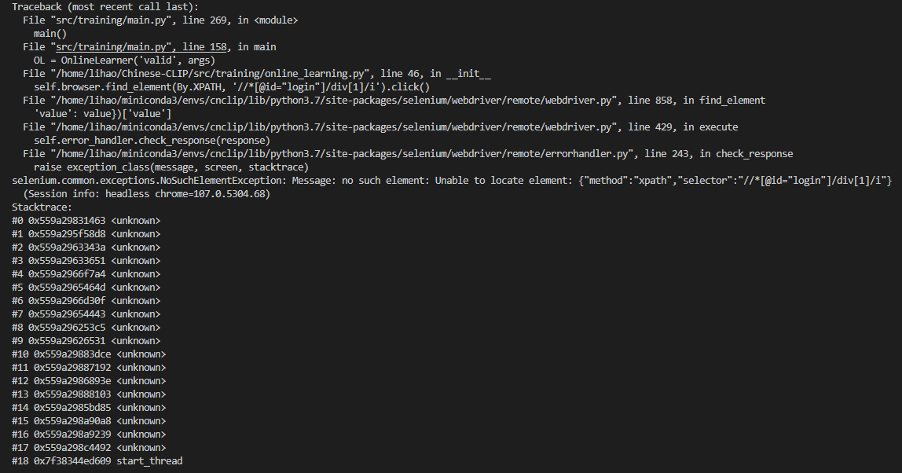

[**中文说明**](README.md)

本项目代码基于<b>[Chinese-CLIP](https://github.com/billjie1/Chinese-CLIP)</b>建设，使用大规模中文数据进行训练（~2亿图文对），可以实现中文领域的跨模态检索。
<br><br>

## 项目环境
本项目使用环境:

* python == 3.7.12
* pytorch >= 1.7.1 (with torchvision)
* CUDA Version == 11.1
* GPU: 8 x RTX A6000 (48G)
* 操作系统: Ubuntu 20.04 LTS

运行下列命令即可安装本项目所需的三方库。

### python库安装:
```bash
pip install -r requirements.txt
```

### apex安装：
我们在工程目录中提供了CUDA 11.x 版本的apex安装文件，安装apex可直接运行下列指令：
```bash
cd apex && pip install -v --no-cache-dir --global-option="--cpp_ext" --global-option="--cuda_ext" ./
```

**Note:** 安装apex前必须已经安装pytorch。

### Chrome && ChromeDriver安装:
我们使用Chrome浏览器作为我们的在线学习平台，且在工程目录中提供了Chrome和ChromeDriver的安装包，安装需运行以下两部分：
#### Chrome
```bash
sudo apt-get install libxss1 libappindicator1 libindicator7
sudo dpkg -i google-chrome-stable_current_amd64.deb sudo apt-get install -f
```
**Note:** 若不使用 **无缓存数据的在线学习** 可不用下载。
#### ChromeDriver
```bash
sudo apt-get install xvfb
sudo apt-get install unzip
unzip chromedriver_linux64.zip
sudo mv -f chromedriver /usr/local/share/chromedriver
sudo ln -s /usr/local/share/chromedriver /usr/local/bin/chromedriver
sudo ln -s /usr/local/share/chromedriver /usr/bin/chromedriver
```

#### 测试是否安装成功
```bash
python src/preprocess/chrome.py
```
输出"安装成功!"即可。

<br><br>


## 数据准备
下载本项目后, 请创建新的文件夹 ```${DATAPATH}``` 以存放数据集、预训练ckpt、以及finetune产生的模型日志&ckpt。推荐工作区目录结构如下：

```
Online-CNCLIP/
├── run_scripts/
│   ├── train.sh
│   └── predict.sh
│
├── mark_log/   # 记录在线学习过程中下载存在问题的query
│
├── valid/   # 存放网络下载的valid图像缓存
│
├── test/    # 存放网络下载的test图像缓存
│
└── src/
    ├── clip/
    ├── eval/
    ├── preprocess/
    └── training/

${DATAPATH}
├── pretrained_weights/   # 预训练模型存放位置
│
├── experiments/          # 在线学习后的模型保存位置
│   └── results/          # 预测结果jsonl文件保存位置
│
├── npy_save_last/        # 末次提交结果的预测矩阵存放位置
│
├── npy_save/             # 测试阶段的预测矩阵保存位置
│
├── resume/               # 测试模型的存放位置
│
└── datasets/
    ├── MUGE/
    └── .../              # 更多自定义数据集...
```

<span id="zip"></span>

对于```${DATAPATH}```，可以直接下载我们提供的**压缩包**（**百度网盘链接：** https://pan.baidu.com/s/1wfXFrxWmelhCGcLMo_cN-w?pwd=tnjr     **提取码：** tnjr），解压后的文件夹即为可直接使用的```${DATAPATH}```文件夹（包含预训练模型（`${DATAPATH}/pretrained_weights`），我们使用的全部数据（`${DATAPATH}/datasets/MUGE`），产生比赛结果的模型（`${DATAPATH}/resume`））。


### 数据集
本项目使用了比赛数据集和MUGE数据集（[下载链接](https://tianchi.aliyun.com/dataset/107332)）中的训练集作为总训练集，使用比赛数据集中的验证集和测试集作为总验证集和

**Note:** 混合数据集已包含于我们提供的[压缩包](#zip)。

### 预训练CKPT

我们使用ViT-B规模的预训练中文CLIP权重下载（[下载链接](https://clip-cn-beijing.oss-cn-beijing.aliyuncs.com/checkpoints/clip_cn_vit-b-16.pt)）。下载的ckpt文件请存放于`${DATAPATH}/pretrained_weights/`目录下。

**Note:** 预训练文件已包含于我们提供的[压缩包](#zip)。

### 数据集格式预处理

```
python src/preprocess/build_lmdb_dataset.py \
    --data_dir ${DATAPATH}/datasets/MUGE \
    --splits train,valid,test
```
`--splits`指定需要转换的数据集划分，以逗号不加空格分隔。转换后，数据集文件夹下会对应增加以下LMDB序列化文件
```
${DATAPATH}
└── datasets/
    └── MUGE/
        └── lmdb/
            ├── train
            │   ├── imgs
            │   └── pairs
            ├── valid
            └── test
```

## 模型训练与测试

我们提供了训练样例脚本`run_scripts/train.sh`。在使用前，请先配置脚本文件最前面的参数。训练产生的log和模型ckpt文件，会自动保存在用户指定的目录下：

相关的训练配置项包括:

### 参数配置

+ 分布式
  + `WORKER_CNT`: 训练的机器个数
  + `GPUS_PER_NODE`: 每个机器上的GPU个数
+ 训练/验证数据
  + `train-data`: 训练数据LMDB目录，准备LMDB数据文件的预处理流程见上。
  + `val-data`: 验证数据LMDB目录。
  + `num-workers`: 训练数据处理（DataLoader）的进程数，默认为4
+ 训练超参数
  + `vision-model`: 指定视觉backbone, 从 `["ViT-B-32", "ViT-B-16", "ViT-L-14"]`选择。
  + `text-model`: 指定文本backbone, 从 `["RoBERTa-wwm-ext-base-chinese", "RoBERTa-wwm-ext-large-chinese"]`选择。
  + `context-length`: 文本输入序列长度。
  + `warmup`: warmup步数。
  + `batch-size`: 训练时单卡batch-size。（请保证`训练样本总数 > batch-size * GPU数`，至少满足1个训练batch）
  + `lr`: 学习率。
  + `wd`: weight decay。
  + `max-steps`: 训练步数，也可通过`max-epochs`指定训练轮数。
  + `freeze-vision`: 是否freeze视觉backbone。
  + `use-augment`: 是否使用[AutoAugment](https://arxiv.org/abs/1805.09501)对图片进行数据增强
  + `valid-batch-size`: 验证时单机batch-size。（请保证`验证集样本总数 > batch-size * GPU数`，至少满足1个验证batch）
  + `valid-step-interval`和`valid-epoch-interval`: 验证step/epoch频率，指定为-1时则在训练中不进行验证
+ 输出选项
  + `name`: 指定输出路径。超参日志, 训练日志以及产出ckpt均会存放至 `${DATAPATH}/experiments/${name}/`。
  + `save-step-frequency`及`save-epoch-frequency`: 存ckpt的步数或轮数间隔。
  + `report-training-batch-acc`: 日志是否报告训练图到文&文到图batch准确率。
+ 权重读取相关选项
  + `resume`: 权重读取的路径。示例脚本中指定为预训练ckpt路径，也可以指定为用户自己finetune的ckpt路径做继续训练。
  + `reset-data-offset`: 是否从此前的数据断点续跑。如batch size或GPU卡数超参改变，建议打开此选项。
  + `reset-optimizer`: 是否使用optimizer state。


### 训练指令

在训练过程中，在线学习将会在valid时进行，我们提供了三种训练模式，分别是**无缓存数据的在线学习**，**有缓存数据的在线学习**，**离线学习**。

#### 无缓存数据的在线学习 （5h）

无缓存数据的在线学习即实时从互联网（淘宝网）上进行数据检索，并进行单步训练。若本地已有部分缓存数据，则会跳过已有缓存数据下载，只进行未缓存部分部分的下载。使用无缓存数据的在线学习运行指令如下：
```bash
cd Online-CNCLIP/
bash run_scripts/train.sh ${DATAPATH} --online-learning
```

运行后，在线学习部分会登录淘宝网，并将用户登录二维码保存为``barcode_${GPU}.jpg``，其中``${GPU}``为多进程的进程号（若使用8卡的话则为0-7，二维码文件保存为```barcode_0.jpg, barcode_1.jpg, ..., barcode_7.jpg```），此时需用户使用手机依次手动扫描所有二维码文件进行登录，随后模型将进行在线学习。二维码登录示意图如下：

<p align="center">
    <br>
    
    
    <br>
<p>

登陆成功后，在valid阶段，模型将进行在线学习，每个batch都会自动从网络捕获数据，并保存在`Online-CNCLIP/valid`目录中，如图所示：

<p align="center">
    <br>
    
    <br>
<p>

**Note:** 由于网络原因，在线学习器初始化时可能会出现如下错误，此时请关闭程序并重新运行代码。

<p align="center">
    <br>
    
    <br>
<p>

#### 有缓存数据的在线学习 （3h）

如果此前已经进行过在线学习，并且已经将所有图片缓存到本地（Online-CNCLIP/valid/），此时可以无需连接网络（登陆淘宝），直接进行缓存数据的在线学习。运行指令如下：
```bash
cd Online-CNCLIP/
bash run_scripts/train.sh ${DATAPATH} --online-learning --online-cache
```
**Note:** 我们上传的代码文件中已包含缓存数据（Online-CNCLIP/valid/），可以直接运行上述指令。

#### 离线学习 （3h）

我们提供了离线学习方式，该方式将仅使用train中提供的离线数据进行学习，在inference过程中将不会进行实时学习。运行指令如下：
```bash
cd Online-CNCLIP/
bash run_scripts/train.sh ${DATAPATH}
```

### 测试指令

我们共提供了四种测试模式，分别是**多模型聚合离线测试**，**单模型离线测试**，**单模型无缓存数据的在线学习测试**，**单模型有缓存数据的在线学习测试**。其中**多模型聚合离线测试**是比赛中最后提交的预测文件的测试方法，模型预测的最终结果文件保存在`${DATAPATH}/experiments/results/`目录下，使用在线学习获得的新模型保存在`${DATAPATH}/experiments/`目录下。

#### 多模型聚合离线测试（末次上传结果的方式）（20min）

末次上传时我们使用了8个模型进行融合，若要获得我们末次上传结果，请将8个模型放置在`${DATAPATH}/resume`文件夹中（模型已在我们提供的[压缩包](#zip)中），并按照 ```model-1.pt, model-2.pt, ..., model-8.pt```的格式依次命名，预测文件将保存在`${DATAPATH}/experiments/results/test_predictions_ensemble.jsonl`。

```bash
cd Online-CNCLIP/
bash run_scripts/predict.sh ${DATAPATH} ensemble None None 1 model-1.pt model-2.pt model-3.pt model-4.pt model-5.pt model-6.pt model-7.pt model-8.pt
```

由于模型的输出具有不稳定性，使用8模型进行融合可能会与上传结果有轻微出入。为了保证**完全一致**的结果复现，我们将末次上传文件预测时8个模型生成的预测矩阵保存为了npy文件，按照下列指令运行即可得到与我们提交完全一致的结果：
```bash
cd Online-CNCLIP/
bash run_scripts/predict.sh ${DATAPATH} ensemble-last
```

**Note:** 多模型文件已包含于我们提供的[压缩包](#zip)。

#### 单模型离线测试 （3min）

若要离线测试单模型，请将模型放置在`${DATAPATH}/resume`文件夹中，并运行如下指令。

```bash
cd Online-CNCLIP/
bash run_scripts/predict.sh ${DATAPATH} single None None 1 ${model_name}
```

其中，`${model_name}`是模型名称，例如，model_name为`${DATAPATH}/resume/model-1.pt`，则运行指令为：
```bash
cd Online-CNCLIP/
bash run_scripts/predict.sh ${DATAPATH} single None None 1 model-1.pt
```

#### 单模型无缓存数据的在线学习测试 （3h）

若要在测试阶段进行单模型的在线学习，请运行下列指令：其中`${max_epochs}`为在线学习的的最大轮数。`${model_name}`是模型名称，放置在`${DATAPATH}/resume`目录下。学习后的模型将保存为`${DATAPATH}/experiments/epoch${start_epoch}_online_${max_epochs}.pt`。

```bash
cd Online-CNCLIP/
bash run_scripts/predict.sh ${DATAPATH} single --online-learning None ${max_epochs} ${model_name}
```

例如，在线学习epoch为50，模型路径为`${DATAPATH}\resume\model-1.pt`，则运行如下指令：
```bash
cd Online-CNCLIP/
bash run_scripts/predict.sh ${DATAPATH} single --online-learning None 50 model-1.pt
```

运行后，在线学习部分会登录淘宝网，并将用户登录二维码保存为**barcode_0.jpg**，此时需用户使用手机手动扫描二维码进行登录，随后模型将进行在线学习。

#### 单模型有缓存数据的在线学习测试 （15min）

如果此前已经进行过在线学习，并且已经将图片缓存到本地（Online-CNCLIP/test/），此时可以无需连接网络，直接进行缓存数据的在线学习。运行指令如下：

```bash
cd Online-CNCLIP/
bash run_scripts/predict.sh ${DATAPATH} single --online-learning --online-cache ${max_epochs} ${model_name}
```

例如，在线学习epoch为50，模型路径为`${DATAPATH}\resume\model-1.pt`，则运行如下指令：

```bash
cd Online-CNCLIP/
bash run_scripts/predict.sh ${DATAPATH} single --online-learning --online-cache 50 model-1.pt
```
